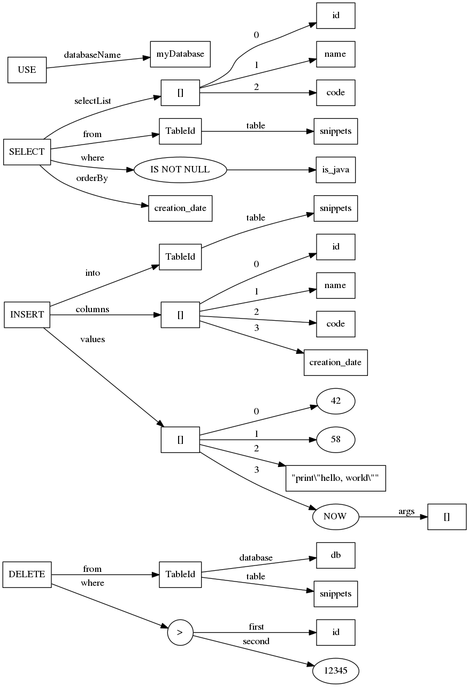

What's here?
============

Little demo parser for a small subset of SQL.

Assembling a fat JAR
====================

    mvn clean test compile assembly:single

will generate a JAR with all dependencies in `target/`.

Running the main
================

Once built, the `main` can be run as follows:

    java -cp target/sqlParser-1.0-SNAPSHOT-jar-with-dependencies.jar sqlparser.Main -text example.sql

This will print a simple text representation of the ASTs. For example, for the input

    USE myDatabase;
    SELECT id, name, code FROM snippets WHERE is_java IS NOT NULL ORDER BY creation_date;
    INSERT INTO snippets (id, name, code, creation_date) VALUES (42, 58, "print\"hello, world\"", NOW());
    DELETE FROM db.snippets WHERE id > 12345

it will generate the following output:
    
    Use(databaseName=myDatabase)
    Select(
      list=[Id(id), Id(name), Id(code)]
      from=Ast.TableId(databaseName=Optional.empty, tableName=snippets)
      where=Ast.IsNullCheck(operand=Id(is_java), not=true)
      orderBy=Id(creation_date)
    )
    Insert(
      into=Ast.TableId(databaseName=Optional.empty, tableName=snippets)
      columns=[id, name, code, creation_date]
      values=[Num(42), Num(58), Str("print\"hello, world\""), FunctionApplication(fun=NOW, args=[])]
    )
    Delete(
      from=Ast.TableId(databaseName=Optional[db], tableName=snippets)
      where=BinOp(Id(id),>,Num(12345))
    )

Generating DOT graphs
=====================

There are two modes in which the tool can be run: `-text` and `-dot`.
The `-dot` option generates code for graphs in DOT format:
    
    java -cp target/sqlParser-1.0-SNAPSHOT-jar-with-dependencies.jar sqlparser.Main -dot example.sql > example.dot

which can then be converted into an image with the `dot` tool:

    dot -Tpng example.dot -o example.png

The result then looks as follows:

Trying out the error messages.
==============================

You can simply make a copy of the example SQL file,
introduce some errors, and then rerun the parser on
the modified file, as described above. You should be
presented with a list of errors.

What's a bit more entertaining is to try it out interactively
with a text editor that can parse the error messages and inline
them into the code. The format of the error messages is the same
as used by Maven. For example, the following configuration works
fine for Sublime Text:

    {
        ... (folders config etc. omitted) ...
    
        "build_systems":
        [
            {
                "name": "sql-parse",
                "shell_cmd": "java -cp target/sqlParser-1.0-SNAPSHOT-jar-with-dependencies.jar sqlparser.Main -text $file",
                "file_regex": 
                  "^\\[ERROR\\] ([a-zA-Z0-9_./-]+):\\[([0-9]+),([0-9]+)\\] (.*)$",
    
                "working_dir": 
                  "/path/to/the/root/of/the/project/of/the/sqlParser/"
            },
        ]
    }

Now the parser can be used as a build system from within the text editor
(activated with `Ctrl+B`), and it behaves roughly like a frontend of a 
very simple compiler.

Generating site and coverage reports
====================================

This will generate the maven site with OpenClover coverage reports,
available under `Reports` in `target/site/index.html`:

    mvn clean clover:setup test site

This will generate the javadoc in `target/site/apidocs/index.html`:

    mvn javadoc:javadoc

 `index.html`
